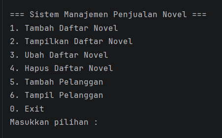
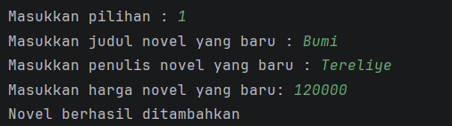
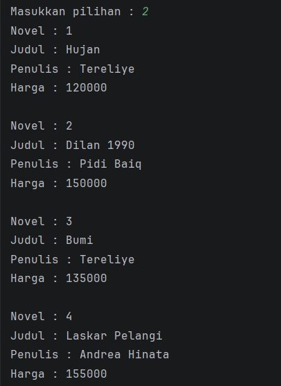
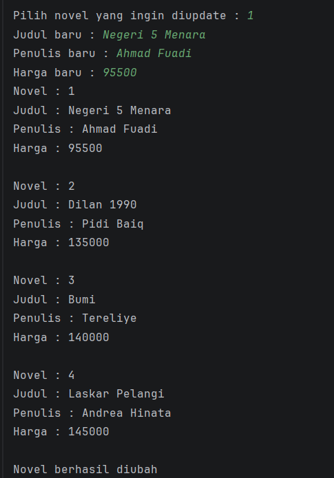
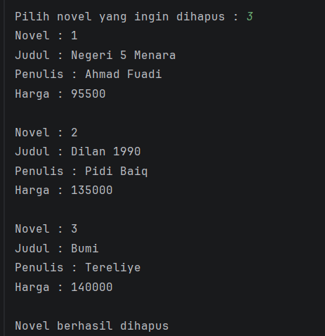
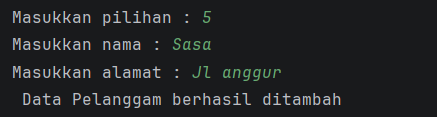
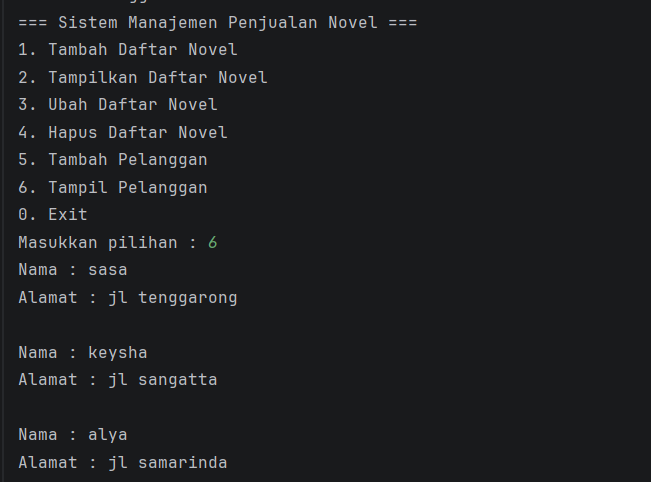

### Nama : Nou Julyanah Mazuwa
### Nim : 2409106066
### Kelas : B1' 24

---
## Deskripsi Program
Program ini dibuat untuk menjelaskan tentang sistem management penjualan novel dengan berbagai fungsi utama, 
seperti menambah, menampilkan, memperbarui, dan menghapus data novel yang tersimpan di dalam program. 
Sistem ini memanfaatkan ArrayList sebagai tempat penyimpanan data sehingga data dapat dikelola secara dinamis selama program berjalan.

Tampilan output menu utama program

Tampilan Output jika memilih menu no 1

Program akan meminta untuk menginputkan judul, penulis, 
harga novel baru untuk di tambahkan ke daftar novel setelah
itu program akan menampilkan bahwa novel berhasil ditambahkan.

Tampilan output jika memilih menu no 2

Program akan menampilkan daftar novel yang terdapat pada sistem

Tampilan output jika memilih menu no 3

Program akan meminta untuk memilih novel yang ingin diubah, setalah itu
program akan meminta menginputkan judul, penulis, dan harga dari novel yang baru
sistem akan menampilkan output bahwa novel berhasil diubah

Tampilan output jika memilih menu no 4

Program akan menampilkan daftar novel dan meminta untuk memilih novel
mana yang ingin dihapus setelah itu program akan menampilkan bahwa novel yang di pilih 
telah terhpaus

Tampilan output jika memilih menu no 5

Program akan meminta untuk menginputkan nama dan alamat pelanggan

Tampilan output jika memilih menu no 6

Program menampilkan data pelanggan